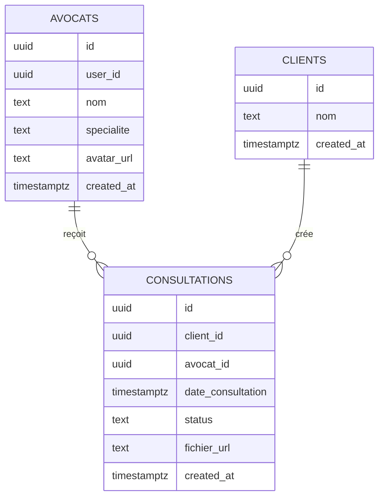

# Avocat-Link

Avocat-Link est une application web qui met en relation des clients et des avocats pour créer, suivre et gérer des consultations juridiques. Le projet s'appuie sur Next.js pour le front-end, Supabase pour l'authentification, la base de données PostgreSQL et le stockage des fichiers, puis Vercel pour le déploiement.

## Mapping du thème

- **Theme**: plateforme de prise de rendez-vous et de suivi de consultations juridiques.

### Schéma des tables



- **Table A**: `avocats` - liste des avocats disponibles.
   - Variables: `id`, `user_id`, `nom`, `specialite`, `avatar_url`, `created_at`.
- **Table B**: `consultations` - demandes de consultation créées par les clients.
   - Variables: `id`, `client_id`, `avocat_id`, `date_consultation`, `status`, `fichier_url`, `created_at`.
- **Table C**: `clients` - profils des utilisateurs clients qui réservent une consultation.
   - Variables: `id`, `nom`, `created_at`.
- **Fichier**: le document PDF téléversé par le client, stocké dans Supabase Storage et référencé par `fichier_url`.

## Analyse d'architecture

1. **Pourquoi Vercel + Supabase est plus logique financièrement qu'un serveur classique ?**
   Pour lancer ce projet, Vercel et Supabase réduisent fortement les coûts initiaux. Un serveur classique demande un investissement de départ important en matériel, configuration et maintenance: c'est du **CAPEX**. Avec Vercel + Supabase, on évite l'achat d'infrastructure et on passe sur un modèle d'usage, donc des coûts d'exploitation variables: c'est surtout de l'**OPEX**. On paie les services au besoin, ce qui est plus adapté à un produit en phase de lancement.

2. **Comment Vercel gère-t-il la scalabilité par rapport à un Data Center physique local ?**
   Vercel scale automatiquement les fonctions et les pages sans que l'équipe doive gérer des serveurs, des racks, la climatisation, l'alimentation de secours ou le remplacement de matériel. Dans un Data Center local, la montée en charge impose des achats physiques, des délais d'installation et une capacité limitée par l'infrastructure disponible. Vercel absorbe la variation de trafic via une infrastructure managée et distribuée, ce qui simplifie la montée en charge.

3. **Dans l'application, qu'est-ce qui représente la donnée structurée et la donnée non structurée ?**
   La donnée **structurée** correspond aux enregistrements PostgreSQL dans les tables `avocats`, `clients` et `consultations`: champs typés, relations, statuts et dates. La donnée **non structurée** correspond aux fichiers déposés par les utilisateurs, surtout les PDF de consultation stockés dans Supabase Storage, ainsi que les images d'avatar des avocats.

## Démarrage local

Le projet Next.js principal se trouve dans le dossier `avocat-link/`.

```bash
cd avocat-link
npm install
npm run dev
```

## Remarques techniques

- Authentification gérée par Supabase Auth.
- Protection des routes via middleware et layout de dashboard.
- Consultation des avocats, création de consultations et suivi des statuts dans le tableau de bord.
- Stockage des fichiers dans un bucket Supabase dédié aux documents de consultation.